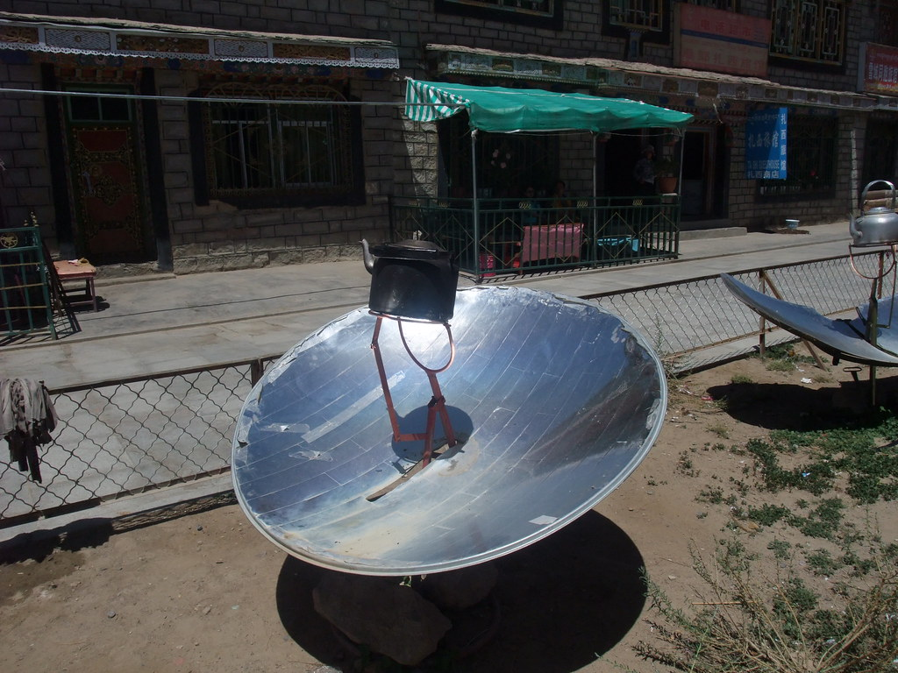

# recette_de_soupe_ramen
exemple d'utilisation du markdown

## lien vers une image en ligne

## image dans un dossier relatif

## liste avec différents niveaux

* liste premier niveau, premier élément
  * liste deuxième niveau, premier élément
    * 3e niveau
  * liste deuxième niveau, 2e élément
* liste premier niveau, deuxième élément
  * le secret c'est la touche TAB 

### insérer un fichier gif

github ne supporte pas les mp4, utilisez un gif pour montrer des animations

### titre 3 b

